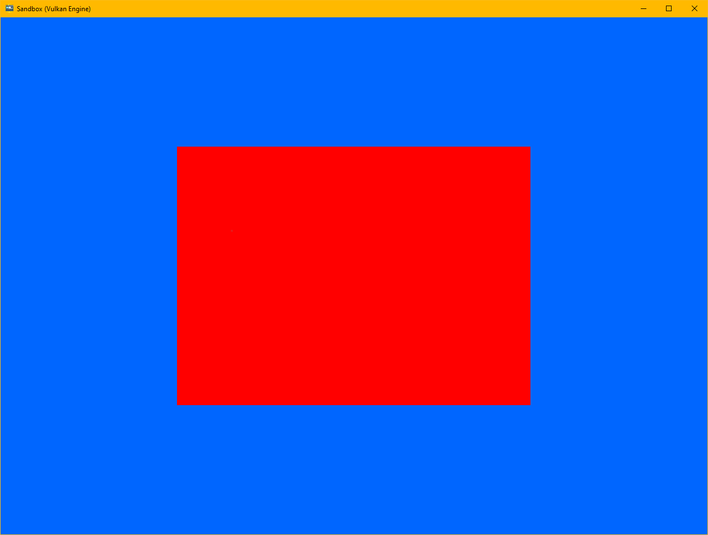

# Vulkan Engine

<p align="center">
  <a href="https://github.com/devodev/vulkan-engine">
    
  </a>
</p>

## Table of contents

- [Overview](#overview)
- [Dependencies](#dependencies)
  - [Setup using MSVC on Windows](#setup-using-msvc-on-windows)
- [Generate icon](#generate-icon)

## Overview

This project is a playground for me to learn [Rust](https://www.rust-lang.org/) as well as the [Vulkan Graphics API](https://www.khronos.org/vulkan/).

It leverages [vulkano-rs/vulkano](https://github.com/vulkano-rs/vulkano) as a rust wrapper around Vulkan.

## Dependencies

We will be compiling libshaderc ourselves (vulkano dependency), which means we will need to have these tools available in our PATH:

- CMake
- Ninja
- Python

### Setup using MSVC on Windows

1. Install rust: <https://www.rust-lang.org/tools/install>
2. Set the default Rust toolchain to msvc: `rustup default nightly-x86_64-pc-windows-msvc`.
   1. We are using nightly so that we can benefit from latest features
3. Use rustfmt nightly: `cargo +nightly fmt`
4. Install [Build Tools for Visual Studio 2022](https://visualstudio.microsoft.com/thank-you-downloading-visual-studio/?sku=Community&channel=Release&version=VS2022&source=VSLandingPage&cid=2030&passive=false).
   1. In the launcher, select the bundle for game dev.
   2. Add bin dir to PATH: `C:\Program Files\Microsoft Visual Studio\2022\Community\VC\Tools\MSVC\14.31.31103\bin\Hostx64\x64`
5. Install [msys2](https://www.msys2.org/), following ALL of the instructions.
   1. Run Installer
   2. Start MSYS2 MSYS from start menu
   3. Run: `pacman -Syu`
      1. Enter Y for everything
   4. Start MSYS2 MSYS from start menu
   5. Run `pacman -Syu`
      1. Enter Y for everything
   6. Install GCC and other build packages: `pacman -S --needed base-devel mingw-w64-x86_64-toolchain`.
      1. Press Enter (default=all), then Y.
6. Then in the msys2 terminal run: `pacman --noconfirm -Syu mingw-w64-x86_64-cmake mingw-w64-x86_64-python2 mingw-w64-x86_64-ninja`
7. Add the msys2 mingw64 binary path to the PATH environment variable.
   1. `C:\msys64`

Optionnaly, install the Vulkan SDK if you plan on enabling Vulkan debug capabilities (`engine.enable_renderer_debug()`):

1. Download and install Vulkan SDK from: <https://vulkan.lunarg.com/sdk/home#windows>

## Generate icon

> Generate icons using the gen_icon crate

Generate sandbox icon

```
cargo run --manifest-path gen_icon/Cargo.toml -- assets/engine-icon.png assets/engine-icon.ico
```
